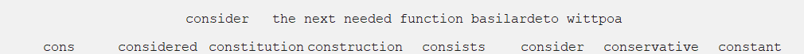
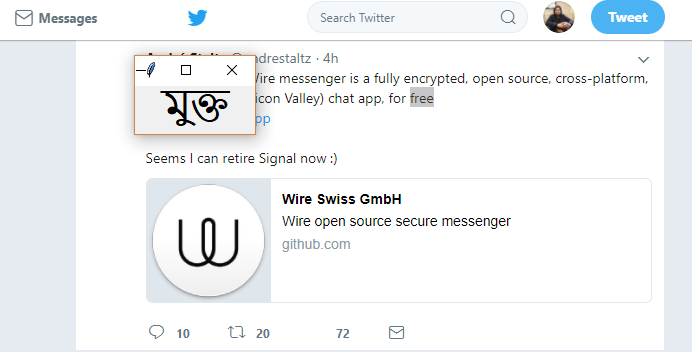
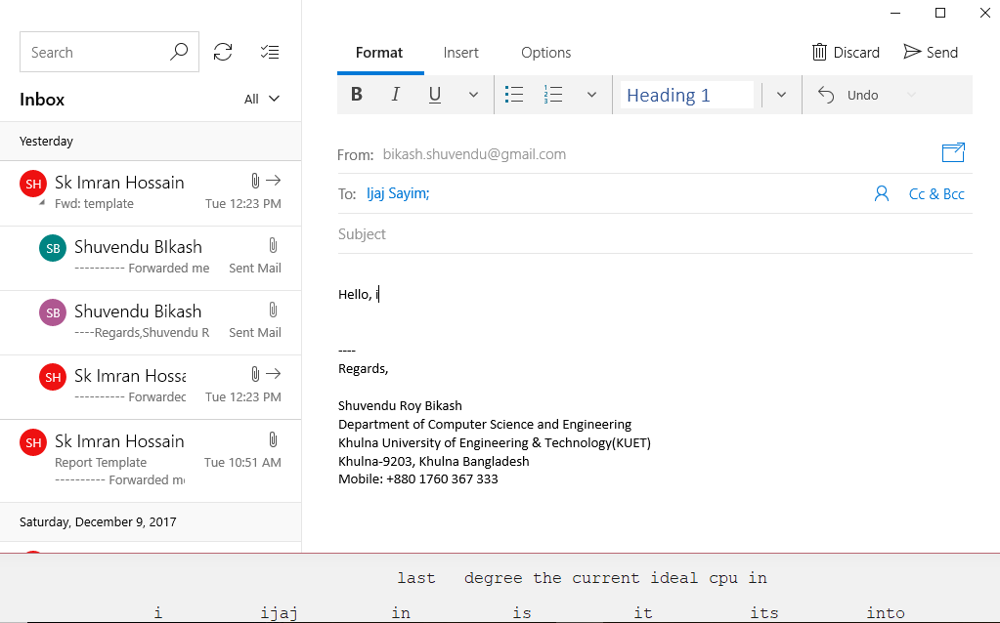

# Smart_Keyboard
Smart typing assistance. Help you to autofill and suggest relavent stuff

## Feature
- Detect the sentence you typing
- Suggest next word with help of LSTM trained on our typing history 
- 6 possible suggestions
- Full sentence suggestion
- Allocated hot key to get the meaning of any word, select any word and press ctrl+c+v
- Take screenshots and parse the words or name written in that page and suggest accordingly 

### standslone dictionary

### suggest from screenshots

## Requirement
pip install tkinter, pythoncom, pyHook 
